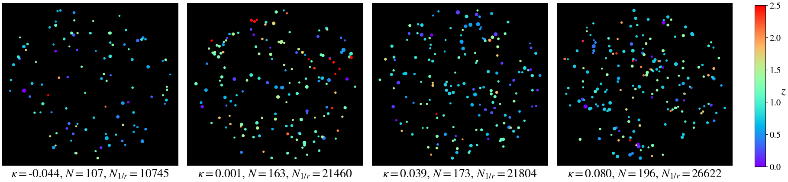

=========================================================================
Node to Joy - Modeling the external convergence from photometric catalogs
=========================================================================

This package contains functionality to
* postprocess the coarse convergence values of an existing simulation to introduce finer fluctuations at galaxy-galaxy lensing scales
* train a Bayesian graph neural network to infer convergence given
photometric measurements of galaxies around a line of sight
* hierarchically infer the mean and standard deviation of convergence in the population

.. image:: https://readthedocs.org/projects/node-to-joy/badge/?version=latest
        :target: https://node-to-joy.readthedocs.io/en/latest/?badge=latest
        :alt: Documentation Status

Installation
============

0. Virtual environments are strongly recommended, to prevent dependencies with conflicting versions. Create a conda virtual environment and activate it:

::

$conda create -n n2j python=3.8 -y
$conda activate n2j

1. Clone the repo and install.

::

$git clone https://github.com/jiwoncpark/node-to-joy.git
$cd node-to-joy
$pip install -e . -r requirements.txt

2. (Optional) To run the notebooks, add the Jupyter kernel.

::

$python -m ipykernel install --user --name n2j --display-name "Python (n2j)"

